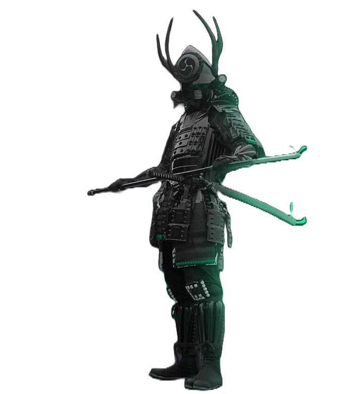

  

  <h2> Hi, I'm Nirmay Rinesh! </h2>
  
  
  
  
  

 

  <h3>About me</h3>

  

  | 
🎓 B.Tech CSE (Cyber Security) Student 
  |
  | --------------------------------------------------------- |
  | 📍 Parul University, India                              |
  | 🤖 AI Developer & Full Stack Developer                                      |  
  | 🛡️ Digital Forensics Enthusiast                                                  |  
  | ⚙️ **Currently building:** <a href="https://nirmay1-creator.github.io/JusticeFlowX">JusticeFlowX</a> & <a href="https://nirmay1-creator.github.io/Rakshika">Rakshika</a>.                    |
  | 💻 **Environment:** Windows + PowerShell.                |
  | 😴 **Love to:** Code & Sleep                    |

---

 

    
  
  
  
  
  
  

 

---

<h2 align="center"> Languages-Frameworks-Tools </h2>
 

<table align="center">
  <tr>
    <td align="center" width="96">
         
    </td>
    <td align="center" width="96">
         
    </td>
    <td align="center" width="96">
         
    </td>
    <td align="center" width="96">
         
    </td>
    <td align="center" width="96">
        
    </td>
    <td align="center"  width="96">
        
    </td>
    <td align="center" width="96">
        
    </td>
  </tr>

  <tr>
    <td align="center" width="96">
        
    </td>
    <td align="center" width="96">
        
    </td>
    <td align="center" width="96">
        
    </td>
    <td align="center" width="96">
        
    </td>
    <td align="center" width="96">
        
    </td>
    <td align="center" width="96">
        
    </td>
    <td align="center"  width="96">
        
    </td>
  </tr>
</table>

 

---

  <h2 align="center">🏅 Competitive Programming 🏅</h2>
   

  

 

 

<!-- Snake Animation -->

  <h2>🐍 Contribution Snake 🐍</h2>
  

 

<h4 align="center">Made with  by <a href="https://github.com/nirmay1-creator">Nirmay Rinesh</a></h4>
