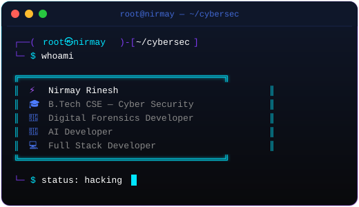

<div align="center">

<!-- ═══════════════════════════════════════════════════════════════ -->
<!-- ░░░░░░░░░░░░░░░░░░░░  HERO BANNER  ░░░░░░░░░░░░░░░░░░░░░░░░ -->
<!-- ═══════════════════════════════════════════════════════════════ -->



<br/>

<!-- Animated Typing -->
<a href="https://github.com/nirmay1-creator">

</a>

<br/>

<!-- Badges Row -->
<a href="https://github.com/nirmay1-creator"></a>
&nbsp;
<a href="https://github.com/nirmay1-creator?tab=followers"></a>
&nbsp;
<a href="https://github.com/nirmay1-creator"></a>

<br/><br/>

<!-- Anime Style Custom SVG -->


<br/><br/>


</div>

<!-- ═══════════════════════════════════════════════════════════════ -->
<!-- ░░░░░░░░░░░░░░░░░░░  ABOUT SECTION  ░░░░░░░░░░░░░░░░░░░░░░░ -->
<!-- ═══════════════════════════════════════════════════════════════ -->

<div align="center">

## 「 ⚡ SYSTEM://ABOUT 」

<sub>▸ IDENTITY MODULE LOADED ▸ CLEARANCE LEVEL: MAXIMUM</sub>

</div>

<br/>

<table align="center" width="100%">
<tr>
<td width="55%" valign="top" align="center">



</td>
<td width="45%" valign="top" align="center">



<br/>

> *「 I alone am the honored one. 」*
> — **Gojo Satoru** · Jujutsu Kaisen

</td>
</tr>
</table>

<div align="center">
<br/>

</div>

<!-- ═══════════════════════════════════════════════════════════════ -->
<!-- ░░░░░░░░░░░░░░░░░░  TECH ARSENAL  ░░░░░░░░░░░░░░░░░░░░░░░░░ -->
<!-- ═══════════════════════════════════════════════════════════════ -->

<div align="center">

## 「 🗡️ TECH://ARSENAL 」

<sub>▸ WEAPONS CACHE ▸ ALWAYS EXPANDING</sub>

<br/><br/>

**`▸ PROGRAMMING LANGUAGES`**


<br/><br/>

**`▸ FRAMEWORKS & LIBRARIES`**


<br/><br/>

**`▸ AI / MACHINE LEARNING`**


<br/><br/>

**`▸ DATABASES & CLOUD`**


<br/><br/>

**`▸ TOOLS & PLATFORMS`**


<br/><br/>

**`▸ SECURITY TOOLS`**

`Wireshark` `Burp Suite` `Nmap` `Metasploit` `Autopsy` `Volatility` `Ghidra` `John the Ripper` `Hashcat`

<br/><br/>


</div>

<!-- ═══════════════════════════════════════════════════════════════ -->
<!-- ░░░░░░░░░░░░░░░░  FEATURED PROJECTS  ░░░░░░░░░░░░░░░░░░░░░░ -->
<!-- ═══════════════════════════════════════════════════════════════ -->

<div align="center">

## 「 🚀 FEATURED://PROJECTS 」

<sub>▸ MISSION-CRITICAL DEPLOYMENTS ▸ FIELD-TESTED</sub>

</div>

<br/>

<!-- PROJECT 1: JusticeFlowX -->
<table align="center" width="100%">
<tr>
<td width="50%" valign="top">

<div align="center">

### ⚖️ JusticeFlowX

**Digital Forensics Investigation Platform**

</div>

A web-based fingerprint crime verification system simulating biometric identity authentication for law enforcement. Scan fingerprints, verify identities, check criminal records, with infrastructure logs for transparency and secure digital justice workflows.

**Key Features:**
- 🔍 Biometric Identity Authentication
- 📋 Chain-of-Custody Tracking
- 🛡️ Evidence Integrity Scanning
- 📊 Interactive Case Dashboards
- 📝 Automated Report Generation

<div align="center">

`HTML` `CSS` `JavaScript` `Python` `FastAPI`

<br/>

[](https://github.com/nirmay1-creator/JusticeFlowX)
[](https://nirmay1-creator.github.io/JusticeFlowX/)


</div>

</td>
<td width="50%" valign="top">

<div align="center">

### 🛡️ Rakshika

**Women Safety Application**

</div>

Emergency SOS with live GPS tracking, AI-powered safety chat assistant, real-time location sharing with trusted contacts, and intelligent danger zone alerts for comprehensive protection.

**Key Features:**
- 🆘 One-Tap Emergency SOS
- 📍 Live GPS Location Tracking
- 🤖 AI Safety Chat Assistant
- 👥 Trusted Contact Sharing
- ⚠️ Danger Zone Alerts

<div align="center">

`TypeScript` `React` `Firebase` `AI Chat` `Maps API`

<br/>

[](https://github.com/nirmay1-creator/Rakshika)
[](https://nirmay1-creator.github.io/Rakshika/)


</div>

</td>
</tr>
</table>

<br/>

<!-- PROJECT 2: MedAssist + PhishGuard -->
<table align="center" width="100%">
<tr>
<td width="50%" valign="top">

<div align="center">

### 🏥 MedAssist AI

**AI-Powered Medical Assistant**

</div>

Intelligent medical assistant leveraging AI for symptom analysis, health recommendations, medical knowledge Q&A, and personalized health insights to make healthcare more accessible.

**Key Features:**
- 🩺 AI Symptom Analysis
- 💊 Health Recommendations
- 📚 Medical Knowledge Base
- 🔬 Personalized Health Insights
- 💬 Natural Language Interface

<div align="center">

`TypeScript` `React` `AI/ML` `Node.js` `TailwindCSS`

<br/>

[](https://github.com/nirmay1-creator/MedAssist-AI)
[](https://nirmay1-creator.github.io/MedAssist-AI/)


</div>

</td>
<td width="50%" valign="top">

<div align="center">

### 🎣 PhishGuard AI

**Phishing URL Detection System**

</div>

ML-powered real-time phishing URL classification with risk scoring, threat analysis, and URL reputation checks to protect users from malicious websites and social engineering attacks.

**Key Features:**
- 🔗 Real-Time URL Analysis
- 🧠 ML-Powered Classification
- 📊 Risk Score Assessment
- 🛡️ Threat Intelligence
- ⚡ Instant Detection

<div align="center">

`TypeScript` `React` `Machine Learning` `Node.js`

<br/>

[](https://github.com/nirmay1-creator/Phising-Url-Detector)
[](https://nirmay1-creator.github.io/Phising-Url-Detector/)


</div>

</td>
</tr>
</table>

<div align="center">
<br/>

> *「 All other projects 」* → [](https://github.com/nirmay1-creator?tab=repositories)

<br/>

</div>

<!-- ═══════════════════════════════════════════════════════════════ -->
<!-- ░░░░░░░░░░░░░░░░  GITHUB STATISTICS  ░░░░░░░░░░░░░░░░░░░░░░ -->
<!-- ═══════════════════════════════════════════════════════════════ -->

<div align="center">

## 「 📊 STATS://DASHBOARD 」

<sub>▸ PERFORMANCE METRICS ▸ REAL-TIME DATA</sub>

<br/><br/>


&nbsp;&nbsp;


<br/><br/>


<br/><br/>


<br/><br/>


<br/><br/>


</div>

<!-- ═══════════════════════════════════════════════════════════════ -->
<!-- ░░░░░░░░░░░░░░░░  SNAKE ANIMATION  ░░░░░░░░░░░░░░░░░░░░░░░░ -->
<!-- ═══════════════════════════════════════════════════════════════ -->

<div align="center">

## 「 🐍 SNAKE://ANIMATION 」

<sub>▸ CONTRIBUTION GRID VISUALIZATION ▸ UPDATES EVERY 12H</sub>

<br/><br/>

<picture>
  <source media="(prefers-color-scheme: dark)" srcset="https://raw.githubusercontent.com/nirmay1-creator/nirmay1-creator/output/snake-dark.svg"/>
  <source media="(prefers-color-scheme: light)" srcset="https://raw.githubusercontent.com/nirmay1-creator/nirmay1-creator/output/snake.svg"/>
  
</picture>

<br/><br/>


</div>

<!-- ═══════════════════════════════════════════════════════════════ -->
<!-- ░░░░░░░░░░░░░░  LEETCODE DASHBOARD  ░░░░░░░░░░░░░░░░░░░░░░░ -->
<!-- ═══════════════════════════════════════════════════════════════ -->

<div align="center">

## 「 ⚔️ LEETCODE://ARENA 」

<sub>▸ ALGORITHM WARFARE ▸ COMPETITIVE PROGRAMMING</sub>

<br/><br/>

<a href="https://leetcode.com/u/NirmaYy/">

</a>

<br/><br/>

<a href="https://leetcode.com/u/NirmaYy/">

</a>

<br/><br/>


</div>

<!-- ═══════════════════════════════════════════════════════════════ -->
<!-- ░░░░░░░░░░░░░░░░  ACHIEVEMENTS  ░░░░░░░░░░░░░░░░░░░░░░░░░░░ -->
<!-- ═══════════════════════════════════════════════════════════════ -->

<div align="center">

## 「 🏆 ACHIEVEMENT://LOG 」

<sub>▸ UNLOCKED MILESTONES ▸ RANK: RISING</sub>

<br/><br/>

<table>
<tr>
<td align="center" width="130">

🏆
<br/>
<b>Hackathon</b>
<br/>
<sub>Finalist</sub>

</td>
<td align="center" width="130">

🌐
<br/>
<b>Open Source</b>
<br/>
<sub>Contributor</sub>

</td>
<td align="center" width="130">

🧮
<br/>
<b>500+</b>
<br/>
<sub>Problems Solved</sub>

</td>
<td align="center" width="130">

🔐
<br/>
<b>Cyber Sec</b>
<br/>
<sub>4+ Projects</sub>

</td>
<td align="center" width="130">

🤖
<br/>
<b>AI / ML</b>
<br/>
<sub>Applications</sub>

</td>
<td align="center" width="130">

🕵️
<br/>
<b>Forensics</b>
<br/>
<sub>Systems Built</sub>

</td>
</tr>
</table>

<br/>


</div>

<!-- ═══════════════════════════════════════════════════════════════ -->
<!-- ░░░░░░░░░░░░░░░░░░  ROADMAP  ░░░░░░░░░░░░░░░░░░░░░░░░░░░░░ -->
<!-- ═══════════════════════════════════════════════════════════════ -->

<div align="center">

## 「 🗺️ ROADMAP://2026 」

<sub>▸ SKILL TREE ▸ NEXT LEVEL TARGETS</sub>

<br/><br/>

```
  ╔═══════════════════════════════════════════════════════════════════╗
  ║                                                                   ║
  ║   ▸ Advanced AI / Deep Learning    ████████████████░░░░  80%      ║
  ║   ▸ Cloud Architecture (AWS/GCP)   ████████████░░░░░░░░  65%      ║
  ║   ▸ Kubernetes & DevOps            ██████████░░░░░░░░░░  55%      ║
  ║   ▸ MERN & Spring Boot Mastery     ██████████████░░░░░░  70%      ║
  ║   ▸ Reverse Engineering            ████████░░░░░░░░░░░░  40%      ║
  ║   ▸ Malware Analysis               ██████░░░░░░░░░░░░░░  30%      ║
  ║   ▸ Blockchain Security            ████░░░░░░░░░░░░░░░░  20%      ║
  ║                                                                   ║
  ╚═══════════════════════════════════════════════════════════════════╝
```

<br/>


</div>

<!-- ═══════════════════════════════════════════════════════════════ -->
<!-- ░░░░░░░░░░░░░░░░  QUOTES  ░░░░░░░░░░░░░░░░░░░░░░░░░░░░░░░░ -->
<!-- ═══════════════════════════════════════════════════════════════ -->

<div align="center">

## 「 💬 QUOTES://TERMINAL 」

<br/>


<br/><br/>

> *「 Arise. 」*
>
> — **Sung Jin-Woo** · Solo Leveling

<br/>

> *「 I'll surpass my limits right here, right now. 」*
>
> — **Yami Sukehiro** · Black Clover

<br/>


</div>

<!-- ═══════════════════════════════════════════════════════════════ -->
<!-- ░░░░░░░░░░░░░░░░░  FUN FACTS  ░░░░░░░░░░░░░░░░░░░░░░░░░░░░ -->
<!-- ═══════════════════════════════════════════════════════════════ -->

<div align="center">

## 「 🎮 FUN://FACTS 」

<br/>

```
  ╔════════════════════════════════════════════════════════════════╗
  ║                                                                ║
  ║   ⚡  I debug in dark mode — light attracts bugs               ║
  ║   🎮  Cyberpunk 2077 & NieR:Automata = my design bible         ║
  ║   📺  Solo Leveling & JJK fuel my 3 AM coding sessions        ║
  ║   ☕  Coffee.exe is my most critical dependency                ║
  ║   🌙  Peak productivity window: 12 AM — 4 AM                  ║
  ║   🔐  I break systems to understand how they work              ║
  ║   🎯  Goal: Build tech that protects & empowers people         ║
  ║                                                                ║
  ╚════════════════════════════════════════════════════════════════╝
```

<br/>


</div>

<!-- ═══════════════════════════════════════════════════════════════ -->
<!-- ░░░░░░░░░░░░░░░  CONNECT SECTION  ░░░░░░░░░░░░░░░░░░░░░░░░░ -->
<!-- ═══════════════════════════════════════════════════════════════ -->

<div align="center">

## 「 🔗 CONNECT://NETWORK 」

<sub>▸ OPEN CHANNELS ▸ ACCEPTING CONNECTIONS</sub>

<br/><br/>

<a href="https://github.com/nirmay1-creator">

</a>
&nbsp;
<a href="https://www.linkedin.com/in/nirmay-rinesh-52229237b/">

</a>
&nbsp;
<a href="https://nirmay1-creator.github.io/NirmayPortfolioo/">

</a>
&nbsp;
<a href="https://leetcode.com/u/NirmaYy/">

</a>

<br/><br/>

<!-- Anime quote to close -->
> *「 The only one who can beat me — is me. 」*
>
> — **Aomine Daiki** · Kuroko no Basket

<br/>

</div>

<!-- ═══════════════════════════════════════════════════════════════ -->
<!-- ░░░░░░░░░░░░░░░░░░  FOOTER  ░░░░░░░░░░░░░░░░░░░░░░░░░░░░░░ -->
<!-- ═══════════════════════════════════════════════════════════════ -->

<div align="center">


</div>

<!--

  ╔═══════════════════════════════════════════════════════════════╗
  ║                                                               ║
  ║   Designed & Crafted by Nirmay Rinesh                         ║
  ║   Cyberpunk OS Theme — 2026 Edition                           ║
  ║                                                               ║
  ║   「 Arise from the shadow. Level up. Never stop. 」           ║
  ║                                                               ║
  ╚═══════════════════════════════════════════════════════════════╝

-->
