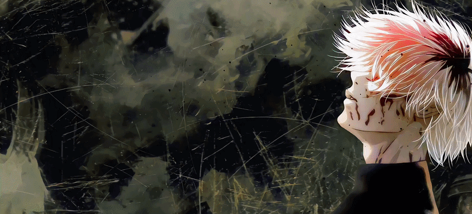
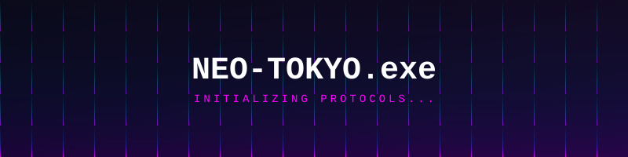
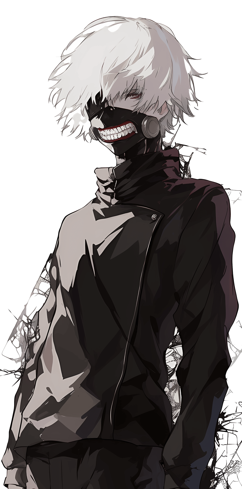
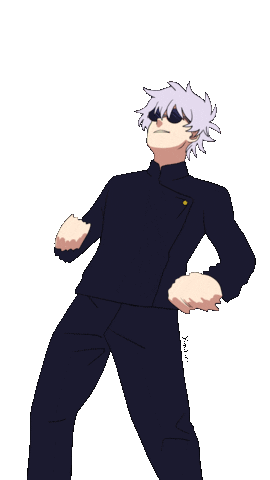
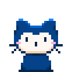
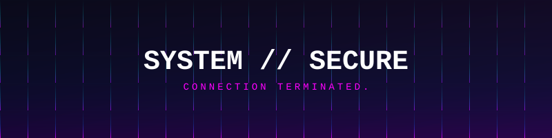

  

  <!-- 🔹 TOP DIVIDER 🔹 -->
  <picture>
    <source media="(prefers-color-scheme: dark)" srcset="https://capsule-render.vercel.app/api?type=rect&height=2&color=333333" />
    
  </picture>
   

  <!-- 🔹 NAME 🔹 -->
  <picture>
    <source media="(prefers-color-scheme: dark)"
      srcset="https://readme-typing-svg.demolab.com?font=Geist+Mono&weight=500&size=40&duration=3000&pause=800&color=00ffff&center=true&vCenter=true&width=600&lines=Nirmay+Rinesh;Cyber+Security+Engineer;AI+Developer" />
    
  </picture>

  <!-- 🔹 ROLE 🔹 -->
  <picture>
    <source media="(prefers-color-scheme: dark)"
      srcset="https://readme-typing-svg.demolab.com?font=Geist+Mono&weight=500&size=14&duration=2000&pause=1000&color=ff00ff&center=true&vCenter=true&width=520&lines=CSE+Student+%E2%80%94+Parul+University;Python+%C2%B7+TypeScript+%C2%B7+React;Full+Stack+%C2%B7+Digital+Forensics" />
    
  </picture>

   
  
  
  
  
    

  

 

  <h3>About me</h3>

  

  | 
🎓 B.Tech CSE (Cyber Security) Student 
  |
  | --------------------------------------------------------- |
  | 📍 Parul University, India                              |
  | 🤖 AI Developer & Full Stack Developer                                      |  
  | 🛡️ Digital Forensics Enthusiast                                                  |  
  | ⚙️ **Currently building:** <a href="https://nirmay1-creator.github.io/JusticeFlowX">JusticeFlowX</a> & <a href="https://nirmay1-creator.github.io/Rakshika">Rakshika</a>.                    |
  | 💻 **Environment:** Windows + PowerShell.                |
  | 😴 **Love to:** Code & Sleep                    |

---

 

    
  
  
  
  
  

 

---

<h2 align="center"> Languages-Frameworks-Tools </h2>
 

<table align="center">
  <tr>
    <td align="center" width="96">
         
    </td>
    <td align="center" width="96">
         
    </td>
    <td align="center" width="96">
         
    </td>
    <td align="center" width="96">
         
    </td>
    <td align="center" width="96">
        
    </td>
    <td align="center"  width="96">
        
    </td>
    <td align="center" width="96">
        
    </td>
  </tr>

  <tr>
    <td align="center" width="96">
        
    </td>
    <td align="center" width="96">
        
    </td>
    <td align="center" width="96">
        
    </td>
    <td align="center" width="96">
        
    </td>
    <td align="center" width="96">
        
    </td>
    <td align="center" width="96">
        
    </td>
    <td align="center"  width="96">
        
    </td>
  </tr>
</table>

 

---

  

 

---

  
  <h2 align="center">🏅 Competitive Programming 🏅</h2>
   

  
   

 

 

<!-- Cool Cyberpunk Terminal -->

  

 

<!-- Animated Glitch Text -->

  

 

  
  <h2>🐍 Contribution Snake 🐍</h2>
   
  <picture>
    <source media="(prefers-color-scheme: dark)" srcset="https://raw.githubusercontent.com/nirmay1-creator/nirmay1-creator/output/snake-dark.svg" />
    <source media="(prefers-color-scheme: light)" srcset="https://raw.githubusercontent.com/nirmay1-creator/nirmay1-creator/output/snake.svg" />
    
  </picture>

 

  
  

<h4 align="center">Made with  by <a href="https://github.com/nirmay1-creator">Nirmay Rinesh</a></h4>
